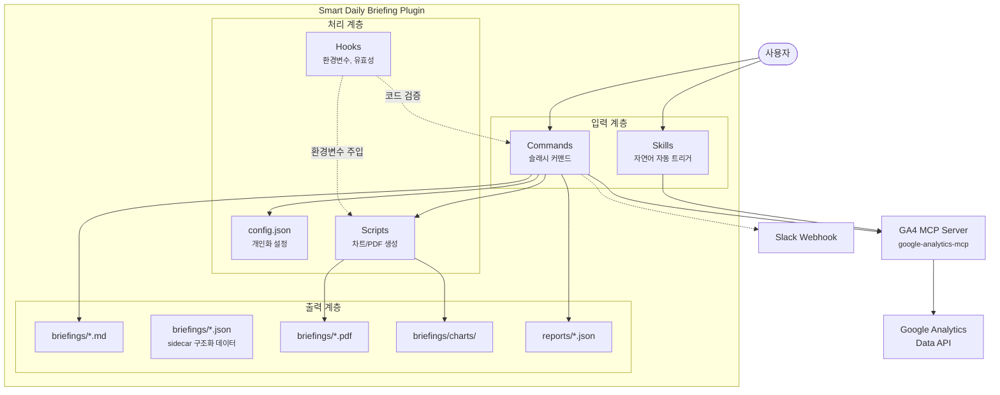
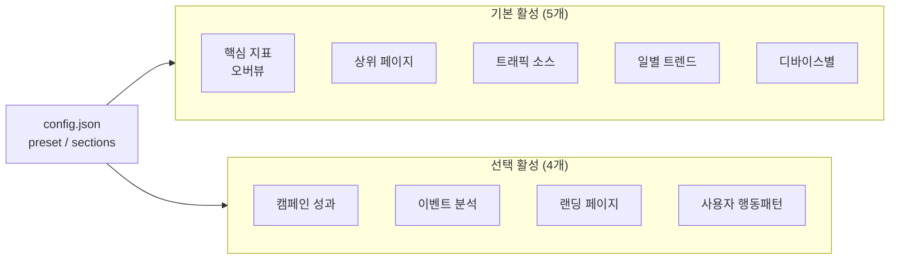
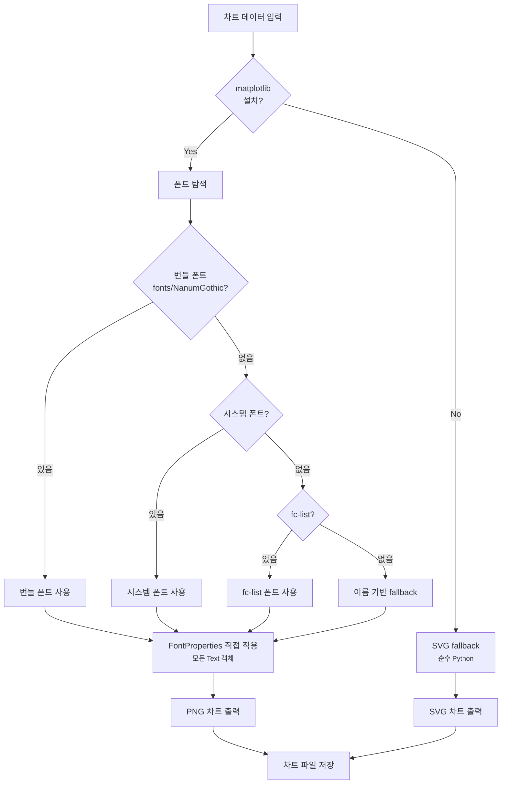
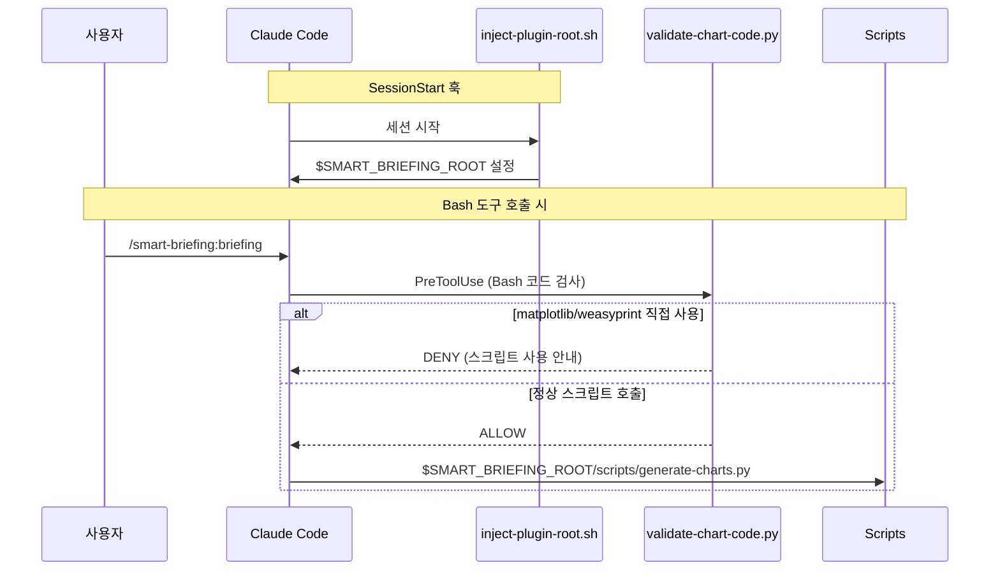
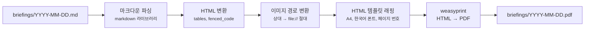
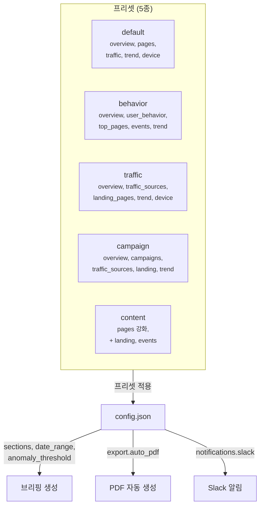
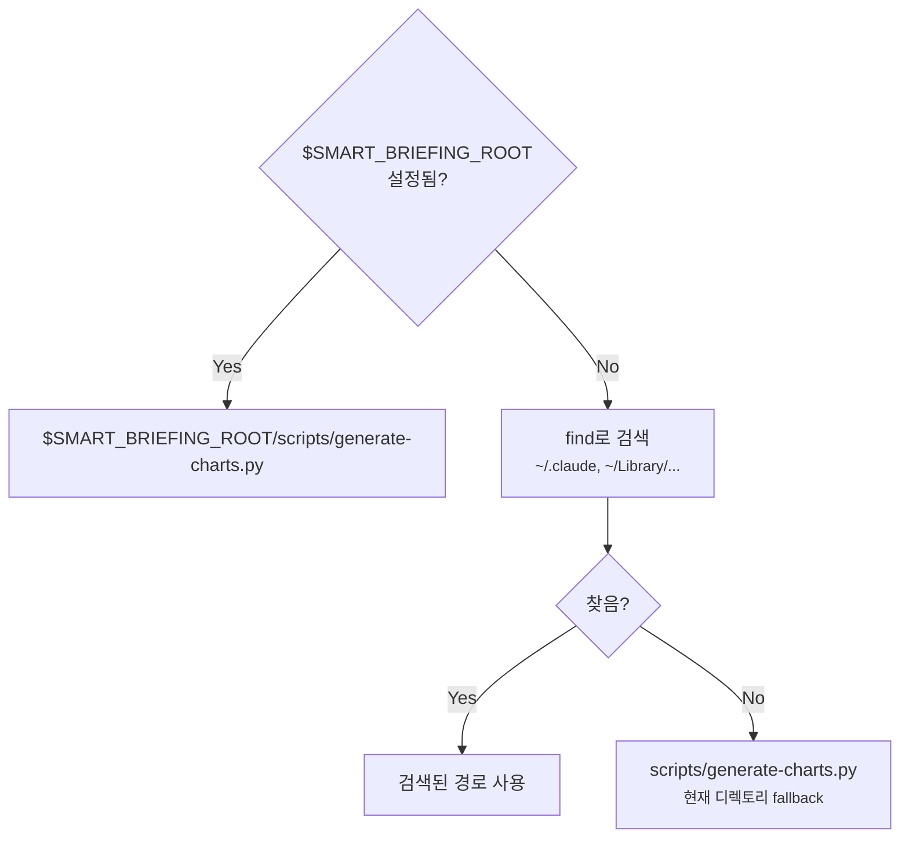

# Architecture - Smart Daily Briefing

플러그인의 핵심 구조와 데이터 흐름을 설명합니다.

---

## 시스템 전체 구조



---

## 브리핑 생성 파이프라인

`/smart-briefing:briefing` 실행 시 전체 흐름입니다.

```mermaid
flowchart LR
    A[config.json 로드] --> B[활성 섹션 필터]
    B --> C[GA4 데이터 수집<br/><small>섹션별 get_ga4_data</small>]
    C --> D[전주 비교 데이터]
    D --> E[이상 탐지<br/><small>±20% 기준</small>]
    E --> F[차트 이미지 생성<br/><small>generate-charts.py</small>]
    F --> G[마크다운 조합]
    G --> H[briefings/YYYY-MM-DD.md<br/>저장]
    H --> I[PDF 자동 생성<br/><small>generate-pdf.py</small>]
    I --> J[briefings/YYYY-MM-DD.pdf<br/>저장]
```



### 브리핑 섹션 구성



---

## 차트 생성 로직



### 차트 종류

| 타입 | 용도 | 섹션 |
|------|------|------|
| `daily_trend` | 일별 추이 라인 차트 | 일별 트렌드, 핵심 지표 |
| `horizontal_bar` | 수평 막대 (Top N) | 상위 페이지, 트래픽 소스, 랜딩 페이지 |
| `pie` | 파이 차트 (비율) | 디바이스별 |
| `change_bar` | 전주 대비 변화율 | 이상 탐지 |

---

## 훅 시스템



| 훅 | 이벤트 | 역할 |
|-----|--------|------|
| `inject-plugin-root.sh` | SessionStart | `$SMART_BRIEFING_ROOT` 환경변수 주입 |
| `validate-chart-code.py` | PreToolUse (Bash) | matplotlib/weasyprint 직접 코드 차단 |

---

## PDF 생성 파이프라인



---

## 설정 시스템



### 주요 설정 항목

| 항목 | 기본값 | 설명 |
|------|--------|------|
| `briefing.date_range` | `7daysAgo` | 데이터 조회 기간 |
| `briefing.anomaly_threshold` | `20` | 이상 탐지 임계값 (%) |
| `briefing.max_insights` | `5` | 인사이트 최대 수 |
| `briefing.max_actions` | `4` | 액션 아이템 최대 수 |
| `export.auto_pdf` | `true` | 브리핑 시 PDF 자동 생성 |
| `notifications.slack.enabled` | `false` | Slack 알림 활성화 |
| `notifications.anomaly_alerts.enabled` | `true` | 이상 탐지 자동 알림 |
| `notifications.anomaly_alerts.cooldown_hours` | `24` | 동일 메트릭 알림 간격 |
| `notifications.anomaly_alerts.max_alerts_per_day` | `10` | 일일 최대 알림 수 |

---

## 플랫폼 분기

```mermaid
graph TB
    User([사용자 요청])

    User --> Detect{실행 환경?}

    Detect -->|Claude Code| CC[슬래시 커맨드<br/><small>/smart-briefing:briefing</small>]
    Detect -->|OpenClaw| OC[자연어 스킬<br/><small>"브리핑 생성해줘"</small>]

    CC --> Core[공통 로직<br/><small>GA4 조회 → 분석 → 저장</small>]
    OC --> Core

    Core --> Schedule{스케줄링?}

    Schedule -->|Claude Code| Launchd[macOS launchd<br/><small>manage-schedule.sh</small>]
    Schedule -->|OpenClaw| Cron[OpenClaw cron<br/><small>크로스 플랫폼</small>]
```

---

## 스크립트 경로 탐색

`$SMART_BRIEFING_ROOT`가 SessionStart 훅으로 자동 설정되며, fallback 체인으로 스크립트를 찾습니다.



---

## v1.10.0 아키텍처 변경사항

### scripts/utils.py (공통 유틸리티)

`generate-charts.py`와 `generate-pdf.py`에서 중복된 코드를 추출한 공유 모듈:

| 함수 | 역할 |
|------|------|
| `ensure_best_python(test_import)` | homebrew Python 우선 자동 전환 |
| `auto_install(*packages)` | pip 자동 설치 (2회 시도) |
| `find_korean_font()` | 한국어 폰트 탐색 (번들 → 시스템 → fc-list) |
| `safe_write(path, data)` | atomic write (tempfile → os.replace) |
| `safe_write_json(path, obj)` | JSON atomic write |

### JSON sidecar 저장

브리핑 생성 시 `briefings/YYYY-MM-DD.json` 파일을 함께 생성합니다.
구조화된 metrics, anomalies, insights를 저장하여 향후 비교/주간 기능의 데이터 소스로 활용합니다.

### AST 기반 코드 검증 (validate-chart-code.py)

기존 regex denylist 방식에서 `ast.NodeVisitor` 기반 whitelist 방식으로 재작성:
- `visit_Import`, `visit_ImportFrom`: 직접 import 차단
- `visit_Call`: `__import__()`, `importlib.import_module()`, `eval()`, `exec()` 차단
- `visit_Constant`: 인코딩된 바이트 리터럴 차단
- 비-Python 코드는 text fallback 검사

### 테스트 프레임워크

`tests/` 디렉토리에 pytest 기반 테스트:
- `test_utils.py`: safe_write, 폰트 검색, auto_install (17 tests)
- `test_validate_chart_code.py`: AST 검증 차단/허용/엣지케이스 (18 tests)

---

## v1.11.0 아키텍처 변경사항

### JSON sidecar 스키마 v1.11 (sidecar_schema.py)

순수 Python 검증기. `jsonschema` 의존성 없이 동작:

| 함수 | 역할 |
|------|------|
| `validate_sidecar(data)` | 스키마 검증 (CRITICAL vs 권장 필드 구분) |
| `normalize_sidecar(data)` | v1.10.0 sidecar를 v1.11 형식으로 정규화 |
| `aggregate_sidecars(sidecars)` | 일별 sidecar를 주간 단위로 집계 (SUM/가중평균) |

스키마에 `schema_version`, `comparable_keys` 필드 추가. 비교 기능의 데이터 소스.

### 주간 브리핑 파이프라인

```
W1: 주간 범위 결정 (월~일 또는 지정 날짜 기준)
W2: sidecar 수집 (4/7 이상 → 집계 / 미만 → GA4 fallback)
W3: 차트 생성 (weekly_trend, weekly_comparison)
W4: 마크다운 생성 (briefings/weekly-YYYY-MM-DD.md)
W5: PDF 자동 생성 (설정에 따라)
```

차트 생성 시 기존 핸들러(`daily_trend`, `overview_change`)를 재사용하여 코드 중복을 방지.

### 환경 진단 (healthcheck.py)

`HealthCheckItem` 기반 확장 가능한 진단 시스템 (8개 항목):

| 항목 | key | 진단 대상 |
|------|-----|-----------|
| config.json | `config` | 설정 파일 유효성 |
| Python 환경 | `python` | 버전 ≥ 3.9 |
| matplotlib | `matplotlib` | 차트 라이브러리 |
| weasyprint | `weasyprint` | PDF 라이브러리 |
| Slack webhook | `slack` | 연결 테스트 |
| sidecar 파일 | `sidecar` | 최근 7일 존재 여부 |
| 한국어 폰트 | `font` | 폰트 탐색 |
| 필수 스크립트 | `scripts` | 4개 스크립트 존재 |

CLI: `python3 scripts/healthcheck.py [--json] [--check key1,key2]`
모듈: `run_healthcheck(plugin_dir, checks)` → `[(key, name, status, message)]`

---

## v1.12.0 아키텍처 변경사항

### Python 통합 알림 시스템 (send-notification.py)

`send-slack.sh`를 대체하는 순수 Python 구현. 채널 추상화 패턴으로 멀티채널 확장 가능:

```
NotificationChannel (base)
├── SlackChannel — Incoming Webhook
├── TelegramChannel — v2.0.0 예정
└── DiscordChannel — v2.0.0 예정
```

| 함수 | 역할 |
|------|------|
| `send_with_retry(ch, payload, config)` | 지수 백오프 재시도 (최대 3회) |
| `enqueue(type, payload)` | 실패 메시지 JSON 큐 저장 |
| `flush_queue(ch, config)` | 큐 재전송 |
| `get_active_channels(config)` | 활성 채널 목록 조회 |

CLI: `python3 scripts/send-notification.py <briefing|test|anomaly|flush|status> [args]`

### 이상 탐지 모니터 (anomaly-monitor.py)

브리핑 sidecar에서 이상 탐지를 추출하고 쿨다운/한도를 적용하여 알림 전송:

```
sidecar.json → extract anomalies → filter (cooldown/limit/severity) → send-notification.py anomaly
                                                                    → .alert-history.json 기록
```

| 기능 | 설명 |
|------|------|
| 쿨다운 | 동일 메트릭 재알림 간격 (기본 24시간) |
| 일일 한도 | 하루 최대 알림 수 (기본 10건) |
| 심각도 필터 | min_severity 이상만 알림 |
| 히스토리 | `.alert-history.json`에 7일간 보관 |

### 브리핑 비교 (briefing compare)

두 날짜의 sidecar JSON을 비교하여 지표 변화를 분석:

```
C1: 비교 대상 결정 (어제 vs 그제 또는 지정 날짜)
C2: sidecar 로드 (comparable_keys 합집합)
C3: 변화율 계산 ((이후-이전)/이전 × 100)
C4: 비교 결과 출력 (터미널만, 파일 저장 없음)
```

### 브리핑 히스토리 (briefing list)

최근 14일 `briefings/` 디렉토리의 .md, .json, .pdf 파일을 탐색하여 목록 출력.
