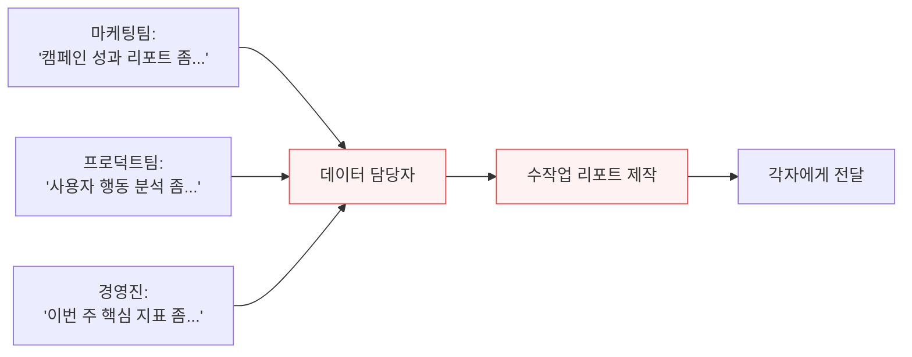
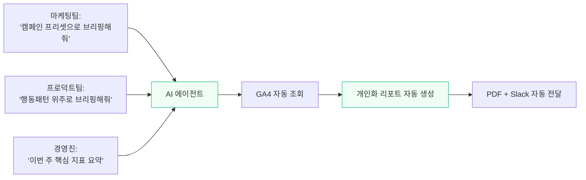
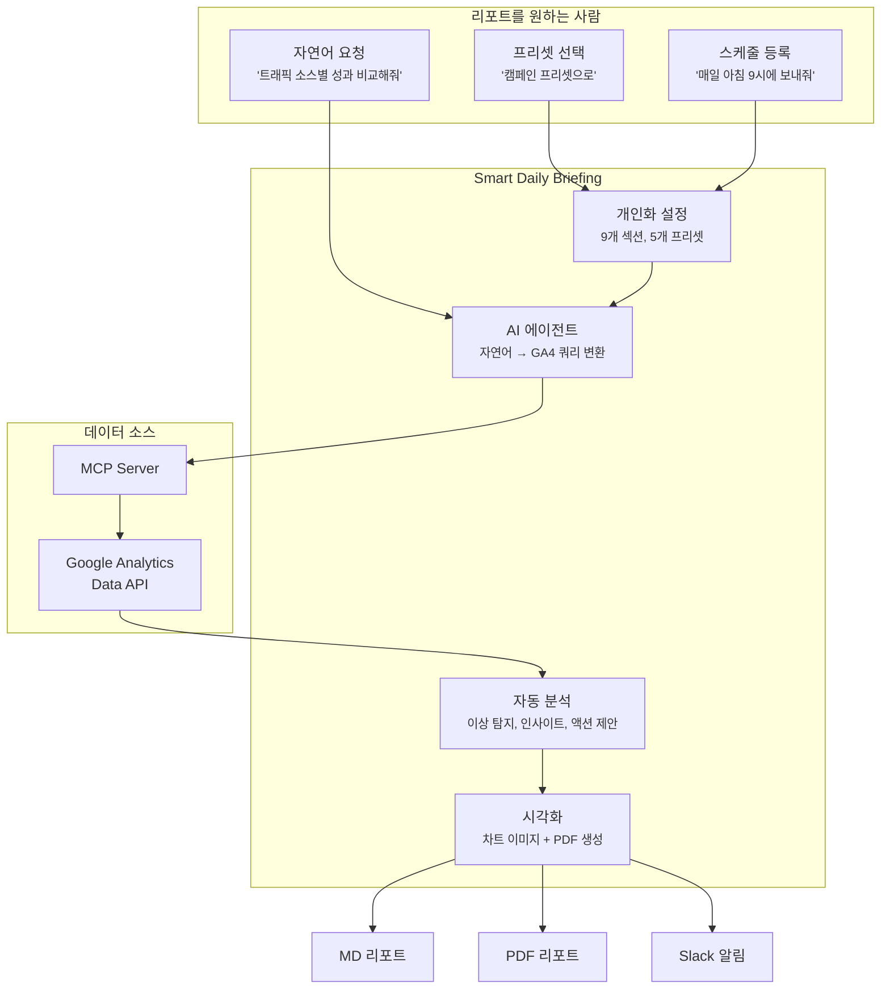

# Smart Daily Briefing - 프로젝트 소개

## 한 줄 요약

GA4 데이터 기반의 **개인화 리포트를 누구나 자연어로 만들어 받아볼 수 있는** AI 에이전트 플러그인.

---

## 왜 이 프로젝트를 시작했는가

### 문제 의식

> **"개인화 리포트를 일일이 사람 손으로 만들지 않고, 리포트를 보고 싶은 사람이 직접 쉽게 만들어서 받아볼 수는 없을까?"**

조직에서 GA4 데이터 리포트는 보통 이렇게 만들어집니다:



데이터 담당자가 병목입니다. 모든 리포트 요청이 한 사람에게 집중되고, 각 팀이 원하는 지표와 관점이 다르기 때문에 매번 새로 만들어야 합니다.

### 이 구조의 근본적인 문제

| 문제 | 구체적 상황 |
|------|-----------|
| **리포트 요청 병목** | 데이터 담당자가 여러 팀의 리포트를 순서대로 처리. 급한 요청도 대기열에 쌓임 |
| **개인화 비용** | 마케팅팀은 캠페인 중심, 프로덕트팀은 사용자 행동 중심 — 같은 GA4인데 매번 다른 리포트를 수동 제작 |
| **반복 노동** | 매주, 매일 같은 구조의 리포트를 만드는 반복 작업. 자동화가 안 되면 사람이 계속 해야 함 |
| **셀프서비스 불가** | 비개발자가 GA4 콘솔이나 Looker Studio를 직접 다루기엔 진입 장벽이 높음 |
| **인사이트 부재** | 대시보드는 숫자를 보여줄 뿐, "왜 변했는지", "뭘 해야 하는지"는 알려주지 않음 |

### 우리가 원한 것



**리포트를 보고 싶은 사람이 직접**, 자연어로 한 마디만 하면 자기 관점에 맞는 리포트가 자동으로 만들어지는 구조. 데이터 담당자가 병목이 되지 않는 셀프서비스 리포팅.

---

## 어떻게 해결하는가

### 핵심 아이디어: AI + MCP + 개인화 설정



1. **자연어 인터페이스** — GA4 콘솔을 몰라도 "모바일 이탈률 어때?"만 물으면 됨
2. **프리셋 기반 개인화** — 역할에 맞는 프리셋(캠페인, 트래픽, 행동패턴 등)을 선택하면 관련 섹션만 자동 활성화
3. **셀프서비스 스케줄링** — "매일 아침 9시에 보내줘"로 자동 리포트 수신 등록
4. **AI 인사이트** — 숫자를 넘어 이상 징후 탐지, 원인 분석, 액션 아이템까지 자동 제공

### Before vs After

| | Before | After |
|--|--------|-------|
| 리포트 요청 | 데이터 담당자에게 요청 후 대기 | **본인이 직접 자연어로 요청** |
| 개인화 | 매번 수동 커스터마이징 | **프리셋 선택 or 섹션 on/off** |
| 리포트 제작 | 사람이 GA4 → 스프레드시트 → 정리 | **AI가 자동 수집 → 분석 → 시각화** |
| 반복 업무 | 매일/매주 수동 반복 | **스케줄 등록으로 자동 수신** |
| 인사이트 | 숫자만 전달, 해석은 각자 | **이상 탐지 + 원인 분석 + 액션 제안** |
| 공유 | 별도 정리 후 전달 | **PDF + Slack 자동 전달** |
| 진입 장벽 | GA4 콘솔, 쿼리, 필터 이해 필요 | **한국어 자연어만으로 가능** |

---

## 핵심 기능

### 1. 자연어 데이터 조회

GA4를 몰라도 자연어로 데이터를 조회하고 분석을 받을 수 있습니다.

```
"이번 주 모바일 이탈률이 어때?"
"트래픽 소스별 성과 비교해줘"
"어제 캠페인 성과 요약"
```

AI가 자연어를 GA4 API 쿼리로 변환하고 결과를 테이블 + 인사이트로 제공합니다.

### 2. 개인화 브리핑

팀원마다 관심 영역이 다른 문제를 **프리셋**으로 해결합니다.

| 프리셋 | 대상 | 주요 섹션 |
|--------|------|----------|
| **default** | 전체 | 핵심 지표, 상위 페이지, 트래픽, 트렌드, 디바이스 |
| **behavior** | 프로덕트팀 | + 사용자 행동패턴, 이벤트, 랜딩 페이지 |
| **traffic** | 마케팅팀 | 트래픽 강화 + 랜딩 페이지, 캠페인 |
| **campaign** | 광고팀 | + 캠페인 성과, 이벤트, 랜딩 페이지 |
| **content** | 콘텐츠팀 | 페이지 강화 + 랜딩 페이지, 이벤트 |

프리셋 외에도 개별 섹션 on/off, 이상 탐지 임계값 변경, 분석 기간 조정 등 세밀한 설정이 가능합니다.

### 3. 자동 브리핑 파이프라인


- 활성화된 섹션의 데이터를 자동 수집
- 전주 대비 이상 징후 탐지 (임계값 설정 가능)
- 차트 이미지 포함 PDF 자동 생성
- 스케줄 설정으로 매일 자동 실행 + Slack 전달

### 4. 멀티 플랫폼

동일한 스킬 정의로 Claude Code와 OpenClaw 두 플랫폼에서 동작합니다.

| 기능 | Claude Code | OpenClaw |
|------|-------------|----------|
| 데이터 조회 | 자연어 | 자연어 |
| 브리핑 생성 | `/smart-briefing:briefing` | "브리핑 생성해줘" |
| 개인화 | `/smart-briefing:customize` | "캠페인 프리셋으로 바꿔줘" |
| 스케줄링 | macOS launchd | OpenClaw cron (크로스 플랫폼) |
| PDF 내보내기 | `/smart-briefing:export` | "PDF로 만들어줘" |

---

## 기술 스택

| 구성요소 | 기술 | 역할 |
|---------|------|------|
| AI 에이전트 | Claude Code / OpenClaw | 자연어 이해, 데이터 분석, 리포트 생성 |
| 데이터 연결 | MCP (Model Context Protocol) | GA4 API와 AI 에이전트 간 브릿지 |
| GA4 서버 | google-analytics-mcp (pipx) | GA4 Data API 호출, 스키마 조회 |
| 차트 생성 | matplotlib (Python) | PNG 차트 이미지, SVG fallback |
| PDF 생성 | weasyprint + markdown (Python) | HTML/CSS 기반 PDF 렌더링 |
| 한국어 폰트 | NanumGothic (번들) | 컨테이너 환경에서도 한국어 렌더링 |
| 스케줄링 | macOS launchd / OpenClaw cron | 자동 브리핑 실행 |
| 알림 | Slack Incoming Webhook | 브리핑 요약 전송 |

---

## 프로젝트 구조

```
smart-daily-briefing/
├── skills/          # AI 스킬 (자연어 트리거, 핵심 로직)
├── commands/        # 슬래시 커맨드 (Claude Code 전용)
├── scripts/         # Python/Shell 스크립트 (차트, PDF, 스케줄, Slack)
├── hooks/           # 세션 훅 (환경변수 주입, 코드 검증)
├── fonts/           # 번들 한국어 폰트
├── docs/            # 플랫폼별 설정 가이드
├── briefings/       # 생성된 브리핑 (MD + PDF + 차트)
└── reports/         # 저장된 리포트 (JSON)
```

> 상세 아키텍처 (데이터 흐름, 훅 시스템, 차트/PDF 파이프라인 등)는 [ARCHITECTURE.md](ARCHITECTURE.md)를 참고하세요.

---

## 해결한 기술적 과제

### 1. 플러그인 내 스크립트 경로 탐색

**문제**: 플러그인이 `~/.claude/` 하위에 설치되면 스크립트의 절대 경로를 알 수 없음.

**해결**: SessionStart 훅이 세션 시작 시 `$SMART_BRIEFING_ROOT` 환경변수를 자동 주입. 모든 Bash 호출에서 즉시 스크립트 위치를 참조 가능.

### 2. 컨테이너 환경 한국어 폰트

**문제**: 클라우드 실행 환경(Cowork GUI 등)은 Linux 컨테이너로, 시스템에 한국어 폰트가 없어 차트/PDF에서 글자가 깨짐.

**해결**: NanumGothic-Regular.ttf를 플러그인에 번들하고, matplotlib `FontProperties(fname=)`로 직접 로드. 시스템 폰트 설치 여부와 무관하게 동작.

### 3. macOS CFF-in-TTC 폰트 문제

**문제**: macOS 기본 한국어 폰트(AppleSDGothicNeo.ttc)가 CFF 데이터를 TTC 컨테이너에 담고 있어 matplotlib에서 렌더링 실패.

**해결**: 표준 TTF 포맷인 AppleGothic.ttf를 우선 사용하도록 변경. `_apply_font_to_all(fig)`로 모든 텍스트 객체에 FontProperties를 직접 적용하여 `rcParams` 불안정성 우회.

### 4. AI의 코드 직접 생성 방지

**문제**: AI가 matplotlib/weasyprint 코드를 인라인으로 생성하면 환경별 호환성, 폰트 설정, 스타일 일관성이 깨짐.

**해결**: PreToolUse 훅이 Bash 코드에서 `import matplotlib`, `from weasyprint` 등을 감지하면 실행을 차단하고, 플러그인 내장 스크립트 사용을 안내.

---

## 개발 히스토리

| 버전 | 주요 변경 |
|------|----------|
| v1.0.0 | 플러그인 구조, 스킬 3종, 커맨드 5종, 브리핑 개인화 |
| v1.1.0 | 차트 이미지 생성 (matplotlib PNG + SVG fallback) |
| v1.2.0 | OpenClaw 연동 (스킬 메타데이터, cron 스케줄, 설정 가이드) |
| v1.3.0 | 리포트별 개별 스케줄 (launchd) |
| v1.5.0 | PDF 내보내기 (weasyprint, 차트 포함, 한국어 폰트) |
| v1.8.0 | SessionStart 훅 ($SMART_BRIEFING_ROOT 환경변수 주입) |
| v1.8.2 | NanumGothic 폰트 번들 (컨테이너 환경 지원) |
| v1.8.3 | PDF 자동 생성 기본 활성화 |
| v1.9.0 | 문서 정비 (ARCHITECTURE.md, PROJECT.md) |

---

## 향후 계획

| 항목 | 상태 | 설명 |
|------|------|------|
| 멀티채널 알림 | 보류 | Telegram, Discord 등 (OpenClaw API 키 이슈 대기) |
| 프로액티브 이상 탐지 | 예정 | 4시간 주기 모니터링, 임계값 초과 시 즉시 알림 |
| 브리핑 히스토리 비교 | 예정 | 어제 vs 오늘 변화 자동 추적 |
| 멀티 Property 지원 | 예정 | 여러 GA4 속성을 하나의 브리핑에서 비교 |
